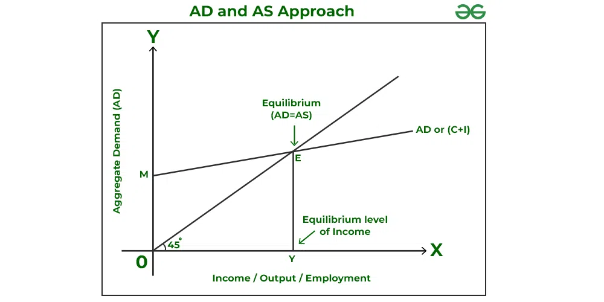
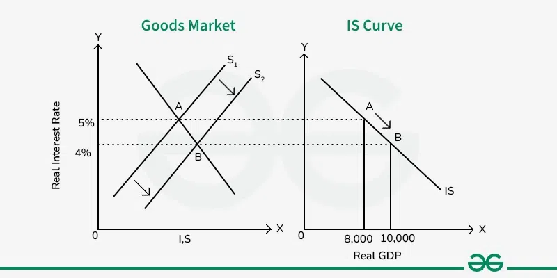

# 📄 Concise Macroeconomics Study Guide - Jacob Clifford

**Primary Source**: [YouTube Video - Macroeconomics- Everything You Need to Know](https://youtu.be/MKO1icFVtDc)
**Duration**: 29:58 minutes
**Instructor**: Jacob Clifford (ACDC Economics)

***

## 📚 Unit 1: Basic Economic Concepts (0:00 - 5:30)

### Scarcity and Opportunity Cost

- **Core Concept**: Unlimited wants vs. limited resources force choices
- **Opportunity Cost**: What you give up to get something else
- **Universal Truth**: Everything has a cost, even if not immediately apparent

### Production Possibilities Curve (PPC)

- **Purpose**: Shows maximum combinations of two goods with available resources
- **Efficiency Levels**:
    - Points on curve = efficient
    - Inside curve = inefficient
    - Outside curve = impossible
- **Curve Types**:
    - Straight line = constant opportunity cost
    - Bowed = increasing opportunity cost
- **Reference**: [BYJU'S Production Possibility Curve](https://byjus.com/commerce/production-possibility-curve/)

### Comparative and Absolute Advantage

- **Absolute Advantage**: Produces more with same resources
- **Comparative Advantage**: Lower opportunity cost
- **Trade Principle**: Both parties benefit when specializing in comparative advantage

***

## 🌍 Comparative Advantage \& Trade (5:30 - 12:30)

### Trade Benefits

- **Key Insight**: Countries benefit from specialization and trade even when one has absolute advantage in all goods
- **Determining Factor**: Comparative advantage (lower opportunity cost) determines trade patterns

### Economic Systems

- **Free Market**: Market forces determine production
- **Command Economy**: Government controls production
- **Mixed Economy**: Combination of both systems
- **Reference**: [Tutor2u - Gains from Trade PPF](https://www.tutor2u.net/economics/reference/key-diagrams-gains-from-trade-using-a-ppf-diagram)

***

## 🔄 Circular Flow Model (12:30 - 19:30)

### Key Players

- **Businesses**:
    - Sell products to individuals
    - Buy resources from individuals
- **Individuals**:
    - Buy products from businesses
    - Sell resources (labor) to businesses
- **Government**:
    - Provides services to both
    - Collects taxes from both

### Important Terms

- **Transfer Payments**: Government payments to individuals
- **Subsidies**: Government money to businesses
- **Factor Payments**: Businesses paying individuals for resources
- **Reference**: [Principles of Microeconomics - Circular Flow](https://ecampusontario.pressbooks.pub/principlesofmicroeconomicscdn/chapter/2-2-circular-flow-model/)

***

## 📈 Supply \& Demand Fundamentals (19:30 - 27:00)

### Demand Curve

- **Shape**: Downward sloping
- **Law of Demand**: Price ↑ → Quantity demanded ↓
- **Relationship**: Inverse relationship between price and quantity

### Supply Curve

- **Shape**: Upward sloping
- **Law of Supply**: Price ↑ → Quantity supplied ↑
- **Relationship**: Direct relationship between price and quantity

### Market Equilibrium

- **Shortage**: Occurs when price is below equilibrium
- **Surplus**: Occurs when price is above equilibrium
- **Market Shifts**: Four possibilities
    - Demand ↑ or ↓
    - Supply ↑ or ↓
- **Reference**: [Economics Help - Supply and Demand](https://www.economicshelp.org/blog/1811/markets/diagrams-for-supply-and-demand/)

***

## 📊 Unit 2: Economic Indicators (27:00 - 43:00)

### Three Economic Goals

- **Economic Growth**: Increase production
- **Low Unemployment**: Limit joblessness
- **Price Stability**: Control inflation

### Gross Domestic Product (GDP)

- **Definition**: Dollar value of all final goods produced in a year within country borders
- **Most Important Equation**: **GDP = C + I + G + Xn**

### GDP Components

- **C**: Consumer spending
- **I**: Investment (business spending)
- **G**: Government spending
- **Xn**: Net exports (exports - imports)
- **Reference**: [Moneychimp - GDP Components](http://www.moneychimp.com/articles/econ/gdp_diagram.htm)

### Business Cycle

- **Peak**: Economy at highest point
- **Recession**: Economic decline
- **Trough**: Lowest point
- **Expansion**: Economic recovery

***

## 👥 Unemployment Analysis (43:00 - 50:00)

### Unemployment Rate Formula

- **Calculation**: **Unemployment Rate = (Unemployed/Labor Force) × 100**

### Three Types of Unemployment

- **Frictional**:
    - Between jobs
    - Actively searching
- **Structural**:
    - Skills don't match job requirements
- **Cyclical**:
    - Due to economic recession

### Natural Rate of Unemployment

- **Components**: Only frictional + structural unemployment
- **Typical Rate**: ~5% in US
- **Goal**: Not 0% - some unemployment is normal and healthy

***

## 💰 Inflation \& Price Indices (50:00 - 56:00)

### Inflation Definitions

- **Inflation**: Money loses purchasing power, prices rise
- **Deflation**: Prices falling
- **Disinflation**: Inflation rate decreasing

### Price Index Formulas

- **CPI**: **CPI = (Market Basket Current Year/Market Basket Base Year) × 100**
- **GDP Deflator**: **GDP Deflator = (Nominal GDP/Real GDP) × 100**

### Causes of Inflation

- **Money Supply Increase**: More money chasing same goods
- **Demand Pull**: Increased demand for goods/services
- **Cost Push**: Production costs rise

***

## 📈 Unit 3: Aggregate Demand \& Supply (56:00 - 1:10:00)

### Aggregate Demand (AD)

- **Shape**: Downward sloping
- **Relationship**: Price level ↑ → Quantity demanded ↓
- **Three Reasons**:
    - Wealth effect
    - Interest rate effect
    - Foreign trade effect

### Aggregate Supply

- **Short Run (SRAS)**: Upward sloping
- **Long Run (LRAS)**: Vertical at full employment GDP

### Economic Gaps

- **Recessionary Gap**:
    - Below full employment
    - High unemployment
- **Inflationary Gap**:
    - Above full employment
    - Rising prices

### Phillips Curve

- **Short Run**: Negative relationship between inflation and unemployment
- **Long Run**: Vertical, no trade-off exists

***

## 🏛️ Fiscal Policy (1:10:00 - 1:15:00)

### Policy Tools

- **Expansionary**:
    - Increase government spending OR
    - Cut taxes
- **Contractionary**:
    - Decrease government spending OR
    - Raise taxes

### Multiplier Effect

- **Formula**: **Spending Multiplier = 1/MPS (Marginal Propensity to Save)**

### Key Concepts

- **MPC**: How much people consume from new income
- **MPS**: How much people save from new income
- **Crowding Out**: Government borrowing increases interest rates

***

## 🏦 Unit 4: Money \& Banking (1:15:00 - 1:25:00)

### Functions of Money

- **Medium of Exchange**: Facilitates transactions
- **Unit of Account**: Standard measure of value
- **Store of Value**: Maintains value over time

### Money Supply

- **M1 Definition**: Currency + Checking accounts (demand deposits)

### Banking System

- **Fractional Reserve Banking**:
    - Banks hold required reserves
    - Loan out excess reserves
- **Formula**: **Money Multiplier = 1/Reserve Requirement**

### Money Market

- **Demand**: Transaction demand + Asset demand
- **Supply**: Vertical (Fed-controlled)
- **Outcome**: Determines nominal interest rate

***

## 🎯 Monetary Policy Tools (1:25:00 - 1:30:00)

### Three Fed Tools

- **Reserve Requirement**: Required bank holdings percentage
- **Discount Rate**: Fed's interest rate to banks
- **Open Market Operations**: Fed buying/selling government bonds

### Policy Effects

- **Expansionary**:
    - Increase money supply → Lower rates → Increase investment
- **Contractionary**:
    - Decrease money supply → Higher rates → Decrease investment

### Loanable Funds Market

- **Demand Side**: Borrowers seeking funds
- **Supply Side**: Savers providing funds
- **Outcome**: Determines real interest rate

***

# 📊 The IS-LM Model - Complete Macroeconomic Model for closed economy

**Video Source**: Vidhi Kalra (Five Minute Economics)  
**Published**: January 2021  
**Duration**: Introduction to IS-LM fundamentals

## 📚 Model Introduction & Background

### Full Form Clarification
- **IS**: Investment-Savings equilibrium
- **LM**: Liquidity preference-Money supply equilibrium

### Historical Development
- **Theoretical Foundation**: Built upon Keynes' "Theory of Employment, Interest and Money"
- **Model Creator**: John Hicks (1937)
- **Further Development**: Extended by Alvin Hansen
- **Alternative Name**: Hicks-Hansen Model

### Core Purpose
The IS-LM model is a Keynesian macroeconomic framework that demonstrates how the market for economic goods interacts with the money market to determine equilibrium output and interest rates.[1][2]

## 🔧 Component Breakdown

### Investment (I)
- **Definition**: Quantity of goods purchased but not consumed immediately
- **Relationship**: Inversely proportional to interest rates
- **Behavior**: When investment ↑, interest rate ↓

### Savings (S)  
- **Definition**: Portion of income not spent on consumption
- **Interest Rate Impact**: When interest rates fall, savings decrease
- **Household Behavior**: Low rates encourage spending over saving

### Liquidity (L)
- **Definition**: Demand for real money in various forms
- **Compensation**: Those providing liquidity receive interest payments and dividends
- **Market Function**: Reflects money demand preferences

### Money Supply (M)
- **Definition**: Any verified record used as payment medium
- **Function**: "Money is what money does"
- **Market Role**: Determines available liquidity in the economy

## 📈 IS Curve Analysis

### Market Representation
- **Describes**: Goods market equilibrium
- **Shape**: Downward sloping (similar to demand curve)
- **Direction**: Slopes downward to the right

### Economic Logic
- **Interest Rate Effect**: As rates fall → increased investment in cars, houses, etc.
- **Savings Behavior**: Lower rates → reduced savings → increased consumption
- **GDP Impact**: Falling interest rates → increased GDP through higher investment and consumption

## 📉 LM Curve Analysis  

### Market Representation
- **Describes**: Money market equilibrium  
- **Shape**: Upward sloping (similar to supply curve)
- **Direction**: Slopes upward to the right

### Economic Logic
- **Economic Expansion**: Growing economy requires more funds
- **Banking Response**: Banks encourage long-term deposits (bonds, CDs)
- **Interest Rate Effect**: Economic expansion → rising interest rates

## ⚖️ Equilibrium Analysis

### Opposing Forces Concept
- **IS Curve**: Interest rate ↓ → Economy expands
- **LM Curve**: Economy expands → Interest rate ↑
- **Market Balance**: Intersection point represents equilibrium

### Equilibrium Point Characteristics
- **Location**: Where IS and LM curves intersect
- **Market Condition**: Both goods and money markets in balance
- **Economic Significance**: Determines equilibrium interest rate and GDP

## 🔄 Curve Shifts & Policy Effects

### IS Curve Shifts (Fiscal Policy)

#### Rightward Shift Causes
- **Primary Factor**: Increased autonomous spending (government spending)
- **Economic Effects**:
  - Output increases (Y → Y')
  - Interest rate increases (r → r')
  - GDP expansion

#### Policy Classification
- **Type**: Expansionary fiscal policy
- **Mechanism**: Government spending stimulates economic activity
- **Curve Behavior**: IS shifts right, LM remains fixed

### LM Curve Shifts (Monetary Policy)

#### Rightward Shift Causes  
- **Primary Factor**: Increased real money supply (RBI regulation)
- **Economic Effects**:
  - Interest rate falls (r → r')
  - Output rises (Y → Y')
  - Economic expansion

#### Policy Classification
- **Type**: Expansionary monetary policy
- **Mechanism**: Increased money supply reduces borrowing costs
- **Curve Behavior**: LM shifts right, IS remains fixed

## ✅ Model Advantages

### Educational Value
- **Simplification**: Explains Keynesian macroeconomics at basic level
- **Policy Tool**: Useful framework for economic policy analysis
- **Teaching Aid**: Effective classroom demonstration model

### Analytical Benefits
- **Joint Determination**: Shows simultaneous equilibrium in two markets
- **Policy Comparison**: Illustrates fiscal vs. monetary policy effects
- **Visual Clarity**: Graphical representation aids understanding

## ❌ Model Limitations

### Simplistic Assumptions
- **Money Supply**: Unrealistic assumptions about monetary mechanics
- **Market Behavior**: Oversimplified market interactions
- **Economic Complexity**: Doesn't capture real-world nuances

### Missing Elements
- **International Markets**: Limited consideration of global economic factors
- **Inflation Dynamics**: Insufficient treatment of price level changes
- **Rational Expectations**: Doesn't incorporate forward-looking behavior

### Creator's Assessment
- **Hicks' Opinion**: Best suited as classroom model rather than practical application tool
- **Academic Use**: More effective for educational purposes than real-world policy analysis

## 🎯 Key Takeaways

The IS-LM model serves as a foundational framework for understanding how fiscal and monetary policies affect economic equilibrium. While it provides valuable insights into the interaction between goods and money markets, its simplified assumptions limit its practical application in complex, real-world economic scenarios.[2][3]

- [1] https://www.youtube.com/watch?v=7OXZnEGHV5I
- [2] https://www.khanacademy.org/economics-finance-domain/macroeconomics/income-and-expenditure-topic/macroeconomics-is-lm/v/lm-part-of-the-is-lm-model

## 🌐 Unit 5: International Economics (1:25:00 - 1:30:00)

### Balance of Payments

- **Current Account**:
    - Trade balance
    - Investment income
- **Financial Account**:
    - Capital flows in/out of country

If trade balance is negative then funds balance has to be positive

### Foreign Exchange

- **Currency Appreciation**:
    - Increases in value → Net exports decrease
- **Currency Depreciation**:
    - Decreases in value → Net exports increase

### Exchange Rate Factors

- **Influencing Variables**:
    - Tastes/preferences
    - Income levels
    - Inflation rates
    - Interest rates
- **Impact**: Affect currency demand and exchange rates

***
## 📚 Long Run Economic curve and national growth

## 📚 Long Run rise and fall of a Nation

## 📚 Additional Resources

### Primary Video Source

- [Macroeconomics- Everything You Need to Know - Jacob Clifford](https://youtu.be/MKO1icFVtDc)

### Supplementary Materials

- [Khan Academy - Macroeconomics Course](https://www.khanacademy.org/economics-finance-domain/ap-macroeconomics)
- [Crash Course Economics Playlist](https://www.youtube.com/playlist?list=PL8dPuuaLjXtPNZwz5_o_5uirJ8gQXnhEO)
- [Federal Reserve Economic Data (FRED)](https://fred.stlouisfed.org/)
- [Bureau of Economic Analysis](https://www.bea.gov/)
- [Congressional Budget Office](https://www.cbo.gov/)
- [How countries go broke] https://economicprinciples.org/downloads/How-Countries-Go-Broke.pdf
- [The Big Debt Cycle] https://amzn.in/d/6Jld8xF

### Unit Difficulty Ratings

- **Unit 1**: 5/10 (Basic Economic Concepts)
- **Unit 2**: 4/10 (Economic Indicators)
- **Unit 3**: 8/10 (Aggregate Demand \& Supply)
- **Unit 4**: 8/10 (Money \& Banking)
- **Unit 5**: 6/10 (International Economics)

⁂

[^1]: https://r2cdn.perplexity.ai/pplx-full-logo-primary-dark@2x.png

