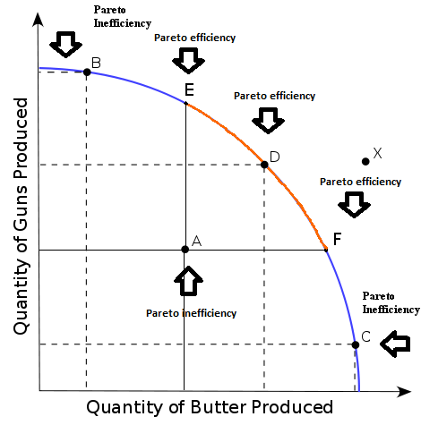
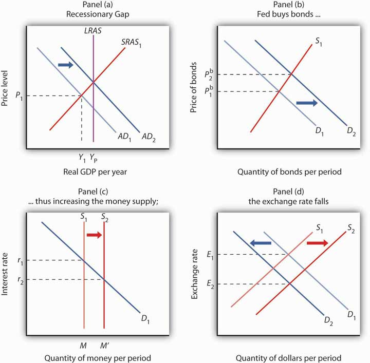

# 📄 Concise Macroeconomics Study Guide - Jacob Clifford

**Primary Source**: [YouTube Video - Macroeconomics- Everything You Need to Know](https://youtu.be/MKO1icFVtDc)
**Duration**: 29:58 minutes
**Instructor**: Jacob Clifford (ACDC Economics)

***

## 📚 Unit 1: Basic Economic Concepts (0:00 - 5:30)

### Scarcity and Opportunity Cost

- **Core Concept**: Unlimited wants vs. limited resources force choices
- **Opportunity Cost**: What you give up to get something else
- **Universal Truth**: Everything has a cost, even if not immediately apparent

### Production Possibilities Curve (PPC)

- **Purpose**: Shows maximum combinations of two goods with available resources
- **Efficiency Levels**:
    - Points on curve = efficient
    - Inside curve = inefficient
    - Outside curve = impossible
- **Curve Types**:
    - Straight line = constant opportunity cost
    - Bowed = increasing opportunity cost
- **Reference**: [BYJU'S Production Possibility Curve](https://byjus.com/commerce/production-possibility-curve/)

### Comparative and Absolute Advantage

- **Absolute Advantage**: Produces more with same resources
- **Comparative Advantage**: Lower opportunity cost
- **Trade Principle**: Both parties benefit when specializing in comparative advantage

***

## 🌍 Comparative Advantage \& Trade (5:30 - 12:30)

### Trade Benefits

- **Key Insight**: Countries benefit from specialization and trade even when one has absolute advantage in all goods
- **Determining Factor**: Comparative advantage (lower opportunity cost) determines trade patterns

### Economic Systems

- **Free Market**: Market forces determine production
- **Command Economy**: Government controls production
- **Mixed Economy**: Combination of both systems
- **Reference**: [Tutor2u - Gains from Trade PPF](https://www.tutor2u.net/economics/reference/key-diagrams-gains-from-trade-using-a-ppf-diagram)

***

## 🔄 Circular Flow Model (12:30 - 19:30)

### Key Players

- **Businesses**:
    - Sell products to individuals
    - Buy resources from individuals
- **Individuals**:
    - Buy products from businesses
    - Sell resources (labor) to businesses
- **Government**:
    - Provides services to both
    - Collects taxes from both

### Important Terms

- **Transfer Payments**: Government payments to individuals
- **Subsidies**: Government money to businesses
- **Factor Payments**: Businesses paying individuals for resources
- **Reference**: [Principles of Microeconomics - Circular Flow](https://ecampusontario.pressbooks.pub/principlesofmicroeconomicscdn/chapter/2-2-circular-flow-model/)

***

## 📈 Supply \& Demand Fundamentals (19:30 - 27:00)

### Demand Curve

- **Shape**: Downward sloping
- **Law of Demand**: Price ↑ → Quantity demanded ↓
- **Relationship**: Inverse relationship between price and quantity

### Supply Curve

- **Shape**: Upward sloping
- **Law of Supply**: Price ↑ → Quantity supplied ↑
- **Relationship**: Direct relationship between price and quantity

### Market Equilibrium

- **Shortage**: Occurs when price is below equilibrium
- **Surplus**: Occurs when price is above equilibrium
- **Market Shifts**: Four possibilities
    - Demand ↑ or ↓
    - Supply ↑ or ↓
- **Reference**: [Economics Help - Supply and Demand](https://www.economicshelp.org/blog/1811/markets/diagrams-for-supply-and-demand/)

***

## 📊 Unit 2: Economic Indicators (27:00 - 43:00)

### Three Economic Goals

- **Economic Growth**: Increase production
- **Low Unemployment**: Limit joblessness
- **Price Stability**: Control inflation

### Gross Domestic Product (GDP)

- **Definition**: Dollar value of all final goods produced in a year within country borders
- **Most Important Equation**: **GDP = C + I + G + Xn**

### GDP Components

- **C**: Consumer spending
- **I**: Investment (business spending)
- **G**: Government spending
- **Xn**: Net exports (exports - imports)
- **Reference**: [Moneychimp - GDP Components](http://www.moneychimp.com/articles/econ/gdp_diagram.htm)

### Business Cycle

- **Peak**: Economy at highest point
- **Recession**: Economic decline
- **Trough**: Lowest point
- **Expansion**: Economic recovery

***

## 👥 Unemployment Analysis (43:00 - 50:00)

### Unemployment Rate Formula

- **Calculation**: **Unemployment Rate = (Unemployed/Labor Force) × 100**

### Three Types of Unemployment

- **Frictional**:
    - Between jobs
    - Actively searching
- **Structural**:
    - Skills don't match job requirements
- **Cyclical**:
    - Due to economic recession

### Natural Rate of Unemployment

- **Components**: Only frictional + structural unemployment
- **Typical Rate**: ~5% in US
- **Goal**: Not 0% - some unemployment is normal and healthy

***

## 💰 Inflation \& Price Indices (50:00 - 56:00)

### Inflation Definitions

- **Inflation**: Money loses purchasing power, prices rise
- **Deflation**: Prices falling
- **Disinflation**: Inflation rate decreasing

### Price Index Formulas

- **CPI**: **CPI = (Market Basket Current Year/Market Basket Base Year) × 100**
- **GDP Deflator**: **GDP Deflator = (Nominal GDP/Real GDP) × 100**

### Causes of Inflation

- **Money Supply Increase**: More money chasing same goods
- **Demand Pull**: Increased demand for goods/services
- **Cost Push**: Production costs rise

***

## 📈 Unit 3: Aggregate Demand \& Supply (56:00 - 1:10:00)

### Aggregate Demand (AD)

- **Shape**: Downward sloping
- **Relationship**: Price level ↑ → Quantity demanded ↓
- **Three Reasons**:
    - Wealth effect
    - Interest rate effect
    - Foreign trade effect

### Aggregate Supply

- **Short Run (SRAS)**: Upward sloping
- **Long Run (LRAS)**: Vertical at full employment GDP

### Economic Gaps

- **Recessionary Gap**:
    - Below full employment
    - High unemployment
- **Inflationary Gap**:
    - Above full employment
    - Rising prices

### Phillips Curve

Difference between longrun (NAIRU) curve and short run curve (philips)

- **Short Run**: Negative relationship between inflation and unemployment
- **Long Run**: Vertical, no trade-off exists

***

## 🏛️ Fiscal Policy (1:10:00 - 1:15:00)

### Policy Tools

- **Expansionary**:
    - Increase government spending OR
    - Cut taxes
- **Contractionary**:
    - Decrease government spending OR
    - Raise taxes

### Multiplier Effect

- **Formula**: **Spending Multiplier = 1/MPS (Marginal Propensity to Save)**

### Key Concepts

- **MPC**: How much people consume from new income
- **MPS**: How much people save from new income
- **Crowding Out**: Government borrowing increases interest rates

***

## 🏦 Unit 4: Money \& Banking (1:15:00 - 1:25:00)

### Functions of Money

- **Medium of Exchange**: Facilitates transactions
- **Unit of Account**: Standard measure of value
- **Store of Value**: Maintains value over time

### Money Supply

- **M1 Definition**: Currency + Checking accounts (demand deposits)

### Banking System

- **Fractional Reserve Banking**:
    - Banks hold required reserves
    - Loan out excess reserves
- **Formula**: **Money Multiplier = 1/Reserve Requirement**

### Money Market

- **Demand**: Transaction demand + Asset demand
- **Supply**: Vertical (Fed-controlled)
- **Outcome**: Determines nominal interest rate

***

## 🎯 Monetary Policy Tools (1:25:00 - 1:30:00)

### Three Fed Tools

- **Reserve Requirement**: Required bank holdings percentage
- **Discount Rate**: Fed's interest rate to banks
- **Open Market Operations**: Fed buying/selling government bonds

### Policy Effects

- **Expansionary**:
    - Increase money supply → Lower rates → Increase investment
- **Contractionary**:
    - Decrease money supply → Higher rates → Decrease investment

### Loanable Funds Market

- **Demand Side**: Borrowers seeking funds
- **Supply Side**: Savers providing funds
- **Outcome**: Determines real interest rate

***

# 📊 The IS-LM Model - Complete Macroeconomic Model for closed economy

**Video Source**: Vidhi Kalra (Five Minute Economics)  
**Published**: January 2021  
**Duration**: Introduction to IS-LM fundamentals

## 📚 Model Introduction & Background

### Full Form Clarification
- **IS**: Investment-Savings equilibrium
- **LM**: Liquidity preference-Money supply equilibrium

### Historical Development
- **Theoretical Foundation**: Built upon Keynes' "Theory of Employment, Interest and Money"
- **Model Creator**: John Hicks (1937)
- **Further Development**: Extended by Alvin Hansen
- **Alternative Name**: Hicks-Hansen Model

### Core Purpose
The IS-LM model is a Keynesian macroeconomic framework that demonstrates how the market for economic goods interacts with the money market to determine equilibrium output and interest rates.[1][2]

## 🔧 Component Breakdown

### Investment (I)
- **Definition**: Quantity of goods purchased but not consumed immediately
- **Relationship**: Inversely proportional to interest rates
- **Behavior**: When investment ↑, interest rate ↓

### Savings (S)  
- **Definition**: Portion of income not spent on consumption
- **Interest Rate Impact**: When interest rates fall, savings decrease
- **Household Behavior**: Low rates encourage spending over saving

### Liquidity (L)
- **Definition**: Demand for real money in various forms
- **Compensation**: Those providing liquidity receive interest payments and dividends
- **Market Function**: Reflects money demand preferences

### Money Supply (M)
- **Definition**: Any verified record used as payment medium
- **Function**: "Money is what money does"
- **Market Role**: Determines available liquidity in the economy

## 📈 IS Curve Analysis

### Market Representation
- **Describes**: Goods market equilibrium
- **Shape**: Downward sloping (similar to demand curve)
- **Direction**: Slopes downward to the right

### Economic Logic
- **Interest Rate Effect**: As rates fall → increased investment in cars, houses, etc.
- **Savings Behavior**: Lower rates → reduced savings → increased consumption
- **GDP Impact**: Falling interest rates → increased GDP through higher investment and consumption

## 📉 LM Curve Analysis  

### Market Representation
- **Describes**: Money market equilibrium  
- **Shape**: Upward sloping (similar to supply curve)
- **Direction**: Slopes upward to the right

### Economic Logic
- **Economic Expansion**: Growing economy requires more funds
- **Banking Response**: Banks encourage long-term deposits (bonds, CDs)
- **Interest Rate Effect**: Economic expansion → rising interest rates

## ⚖️ Equilibrium Analysis

### Opposing Forces Concept
- **IS Curve**: Interest rate ↓ → Economy expands
- **LM Curve**: Economy expands → Interest rate ↑
- **Market Balance**: Intersection point represents equilibrium

### Equilibrium Point Characteristics
- **Location**: Where IS and LM curves intersect
- **Market Condition**: Both goods and money markets in balance
- **Economic Significance**: Determines equilibrium interest rate and GDP

## 🔄 Curve Shifts & Policy Effects

### IS Curve Shifts (Fiscal Policy)

#### Rightward Shift Causes
- **Primary Factor**: Increased autonomous spending (government spending)
- **Economic Effects**:
  - Output increases (Y → Y')
  - Interest rate increases (r → r')
  - GDP expansion

#### Policy Classification
- **Type**: Expansionary fiscal policy
- **Mechanism**: Government spending stimulates economic activity
- **Curve Behavior**: IS shifts right, LM remains fixed

### LM Curve Shifts (Monetary Policy)

#### Rightward Shift Causes  
- **Primary Factor**: Increased real money supply (RBI regulation)
- **Economic Effects**:
  - Interest rate falls (r → r')
  - Output rises (Y → Y')
  - Economic expansion

#### Policy Classification
- **Type**: Expansionary monetary policy
- **Mechanism**: Increased money supply reduces borrowing costs
- **Curve Behavior**: LM shifts right, IS remains fixed

## ✅ Model Advantages

### Educational Value
- **Simplification**: Explains Keynesian macroeconomics at basic level
- **Policy Tool**: Useful framework for economic policy analysis
- **Teaching Aid**: Effective classroom demonstration model

### Analytical Benefits
- **Joint Determination**: Shows simultaneous equilibrium in two markets
- **Policy Comparison**: Illustrates fiscal vs. monetary policy effects
- **Visual Clarity**: Graphical representation aids understanding

## ❌ Model Limitations

### Simplistic Assumptions
- **Money Supply**: Unrealistic assumptions about monetary mechanics
- **Market Behavior**: Oversimplified market interactions
- **Economic Complexity**: Doesn't capture real-world nuances

### Missing Elements
- **International Markets**: Limited consideration of global economic factors
- **Inflation Dynamics**: Insufficient treatment of price level changes
- **Rational Expectations**: Doesn't incorporate forward-looking behavior

### Creator's Assessment
- **Hicks' Opinion**: Best suited as classroom model rather than practical application tool
- **Academic Use**: More effective for educational purposes than real-world policy analysis

## 🎯 Key Takeaways

The IS-LM model serves as a foundational framework for understanding how fiscal and monetary policies affect economic equilibrium. While it provides valuable insights into the interaction between goods and money markets, its simplified assumptions limit its practical application in complex, real-world economic scenarios.[2][3]

- [1] https://www.youtube.com/watch?v=7OXZnEGHV5I
- [2] https://www.khanacademy.org/economics-finance-domain/macroeconomics/income-and-expenditure-topic/macroeconomics-is-lm/v/lm-part-of-the-is-lm-model

## 🌐 Unit 5: International Economics (1:25:00 - 1:30:00)

### Balance of Payments

- **Current Account**:
    - Trade balance
    - Investment income
- **Financial Account**:
    - Capital flows in/out of country

If trade balance is negative then funds balance has to be positive

### Foreign Exchange

- **Currency Appreciation**:
    - Increases in value → Net exports decrease
- **Currency Depreciation**:
    - Decreases in value → Net exports increase

### Exchange Rate Factors

- **Influencing Variables**:
    - Tastes/preferences
    - Income levels
    - Inflation rates
    - Interest rates
- **Impact**: Affect currency demand and exchange rates

***
## 📚 Long Run Economic curve and national growth

# 📊 The Solow Growth Model - Complete Study Guide

The Solow Growth Model emerged from the work of Robert Solow (and independently, Trevor Swan) in 1956. This fundamental macroeconomic model describes how "natural output" evolves in an economy with a constant saving rate, addressing the key question: **Can an economy sustain perpetual growth in per-capita income through ongoing increases in capital?** The answer is definitively **no**.[1]

## 📈 Aggregate Production Function

### **Core Framework**
The centerpiece of every growth model is the aggregate production function. In the Solow model, this is expressed as:[1]

$$ Y(t) = F(K(t), A(t)L(t)) $$

Where:
- **Y(t)**: Output at time t
- **K(t)**: Capital stock at time t  
- **A(t)**: Technology/productivity index
- **L(t)**: Labor force at time t

### **Production Function Conditions**
The model requires several key assumptions about the production function:[1]

- **Marginal Product of Capital (MPK)**: Positive and diminishing
  $$ \frac{\partial F}{\partial K}(K,AL) > 0, \quad \frac{\partial^2 F}{\partial K^2}(K,AL)  0, \quad \frac{\partial^2 F}{\partial L^2}(K,AL)  0 $$

### **Intensive Form**
By setting $$c = 1/AL$$, we derive the intensive form:[1]
$$ y = f(k) $$

Where:
- $$y = Y/AL$$ (output per effective worker)
- $$k = K/AL$$ (capital per effective worker)

The intensive production function exhibits:
- **Positive but diminishing returns**: $$f'(k) > 0, f''(k)  0$$ → capital increases
- **Above $$k^*$$**: Investment falls short of breakeven → $$\dot{k}  n + g$$ → economy overinvests in capital
- **Underinvestment**: $$r < n + g$$ → economy saves too little for optimal long-term consumption

## 📉 Convergence Dynamics

### **Convergence Rate**
Using Taylor approximation around steady state, the convergence rate is:[1]
$$ \lambda = (1 - \alpha_K)(n + g + \delta) $$

Where $$\alpha_K$$ is capital's share (approximately 1/3).

### **Convergence Implications**
With calibration $$n + g = 6\%$$ and $$\alpha_K = 1/3$$:[1]
- **Annual convergence**: ~4% of gap eliminated per year
- **Half-life**: Approximately 18 years to eliminate half the gap
- **Pattern**: Asymptotic exponential convergence

### **Empirical Evidence**
Studies suggest actual convergence rates closer to 2% annually, possibly indicating $$\alpha_K = 2/3$$ when including human capital.[1]

## 🌱 Natural Resources Extension

### **Production with Depletable Resources**
Including natural resources $$R(t)$$ and land $$T(t)$$ in Cobb-Douglas form:[1]
$$ Y(t) = K(t)^\alpha R(t)^\beta T(t)^\gamma [A(t)L(t)]^{1-\alpha-\beta-\gamma} $$

### **Growth Drag Effect**
Steady-state per-capita growth becomes:[1]
$$ g_{Y/L}^* = g - \frac{\beta b + \gamma \cdot 0}{1-\alpha} = g - \frac{\beta b}{1-\alpha} $$

Where $$b$$ is the rate of natural resource depletion.

### **Policy Implications**
Natural resources create **growth drag** of approximately 0.25% annually according to Nordhaus estimates, though this depends critically on the elasticity of substitution between factors.[1]

## 🎯 Model Summary & Limitations

### **Key Results**
- **Unique steady state**: Economy converges to stable growth path[1]
- **Growth sources**: Only labor force growth ($$n$$) and technological progress ($$g$$) sustain long-term growth[1]
- **Capital limits**: Diminishing returns prevent capital accumulation from driving perpetual per-capita growth[1]
- **Policy effects**: Saving rate changes have level effects, not growth effects[1]

### **Critical Weakness**
The model's crucial limitation is the **ad-hoc assumption of constant saving rate**. This raises questions about consistency with optimal, utility-maximizing consumer behavior, leading to more sophisticated models like the Ramsey growth model that endogenize saving decisions.[1]

***

# 🌐 International Asset Markets & Exchange Rate Dynamics

## 💱 Foreign Exchange Market Structure

### **Market Characteristics**
The foreign exchange (forex) market represents the largest financial market globally, with daily trading volumes exceeding $7 trillion. This decentralized market operates 24 hours across major financial centers: London, New York, Tokyo, and Singapore.

### **Market Participants**
- **Commercial Banks**: Primary market makers facilitating customer transactions and proprietary trading
- **Central Banks**: Intervene to influence exchange rates and implement monetary policy
- **Multinational Corporations**: Hedge currency exposure from international operations
- **Institutional Investors**: Pension funds, hedge funds, and asset managers seeking portfolio diversification
- **Retail Traders**: Individual investors accessing markets through electronic platforms

## 📊 Exchange Rate Determination Models

### **Purchasing Power Parity (PPP)**
PPP theory suggests exchange rates adjust to equalize purchasing power across countries:

**Absolute PPP**: $$ S = \frac{P_{domestic}}{P_{foreign}} $$

**Relative PPP**: $$ \frac{S_t}{S_{t-1}} = \frac{1 + \pi_{domestic}}{1 + \pi_{foreign}} $$

Where S is the exchange rate and π represents inflation rates.

### **Interest Rate Parity Conditions**

**Covered Interest Parity (CIP)**:
$$ \frac{F}{S} = \frac{1 + i_{domestic}}{1 + i_{foreign}} $$

**Uncovered Interest Parity (UIP)**:
$$ E[S_{t+1}] = S_t \frac{1 + i_{domestic}}{1 + i_{foreign}} $$

### **Monetary Model**
The monetary approach links exchange rates to relative money supplies and economic fundamentals:
$$ S = \frac{M_{domestic}/M_{foreign}}{(Y_{domestic}/Y_{foreign})^\phi} $$

Where φ represents income elasticity of money demand.

## 🏦 International Asset Portfolio Theory

### **Portfolio Balance Model**
Investors optimize portfolios considering expected returns, risks, and correlations across international assets. The optimal portfolio weight for foreign assets depends on:

- **Expected return differentials**
- **Exchange rate volatility**
- **Correlation with domestic assets**
- **Risk aversion parameters**

### **Capital Asset Pricing Model (CAPM) Extension**
International CAPM incorporates exchange rate risk:
$$ E[R_i] = R_f + \beta_{i,m}[E[R_m] - R_f] + \beta_{i,s}[E[R_s] - R_f] $$

Where β_{i,s} represents sensitivity to exchange rate movements.

### **Home Bias Phenomenon**
Despite diversification benefits, investors exhibit **home bias** - overweighting domestic assets relative to optimal international diversification. Explanations include:
- **Information asymmetries**
- **Transaction costs**
- **Regulatory constraints**
- **Behavioral factors**

## 💹 Capital Flow Dynamics

### **Types of Capital Flows**

**Foreign Direct Investment (FDI)**:
- Long-term investment in productive assets
- Relatively stable during crises
- Driven by fundamental economic factors

**Portfolio Investment**:
- Purchases of stocks and bonds
- More volatile and sentiment-driven
- Sensitive to interest rate differentials

**Short-term Capital Flows**:
- Bank lending and deposits
- Highly volatile and pro-cyclical
- Can trigger sudden stops during crises

### **Trilemma of International Finance**
Countries face impossible trinity of simultaneously achieving:
1. **Fixed exchange rates**
2. **Independent monetary policy**  
3. **Free capital mobility**

Policy makers must sacrifice one objective to maintain the other two.

## 🔄 Exchange Rate Regimes

### **Fixed Exchange Rate Systems**
- **Currency board**: Domestic currency backed by foreign reserves
- **Conventional peg**: Central bank maintains exchange rate within narrow band
- **Crawling peg**: Gradual adjustment of parity rate

### **Flexible Exchange Rate Systems**
- **Free float**: Market forces determine exchange rate
- **Managed float**: Occasional central bank intervention
- **Inflation targeting**: Exchange rate flexibility supports price stability

### **Regime Choice Factors**
- **Economic size and openness**
- **Inflation credibility**
- **Financial market development**
- **Political economy considerations**

## ⚡ Crisis Dynamics & Contagion

### **Currency Crisis Models**

**First Generation (Krugman Model)**:
- Inconsistent fiscal and monetary policies
- Predictable timing based on reserve depletion
- Self-fulfilling attacks when fundamentals deteriorate

**Second Generation (Obstfeld Model)**:
- Multiple equilibria possible
- Self-fulfilling crises independent of fundamentals
- Government optimization between exchange rate stability and other objectives

**Third Generation Models**:
- Balance sheet effects and moral hazard
- Financial sector vulnerabilities
- Interaction between currency and banking crises

### **Contagion Mechanisms**
- **Trade linkages**: Competitive devaluations affect trading partners
- **Financial linkages**: Common lender exposure across countries
- **Information-based contagion**: Signals about fundamentals or investor sentiment
- **Pure contagion**: Herding behavior and liquidity constraints

## 🛡️ Risk Management & Hedging

### **Currency Risk Types**
- **Transaction exposure**: Cash flow effects from committed transactions
- **Translation exposure**: Balance sheet effects from consolidation
- **Economic exposure**: Long-term competitive position changes

### **Hedging Instruments**
- **Forward contracts**: Customized OTC agreements for future delivery
- **Currency futures**: Standardized exchange-traded contracts
- **Currency options**: Right but not obligation to exchange at specified rate
- **Currency swaps**: Exchange of principal and interest in different currencies

### **Corporate Hedging Strategies**
- **Financial hedging**: Using derivative instruments
- **Operational hedging**: Matching revenues and costs by currency
- **Natural hedging**: Diversifying operations geographically

This comprehensive framework illustrates how international asset markets and exchange rate mechanisms interact to determine global capital allocation, risk pricing, and economic stability across interconnected economies.

[1] https://www.reed.edu/economics/parker/s19-314/notes/Solow_Notes.pdf
[2] https://www.reed.edu/economics/parker/s19-314/notes/Solow

## 📚 Long Run rise and fall of a Nation

## 📚 Additional Resources

### Primary Video Source

- [Macroeconomics- Everything You Need to Know - Jacob Clifford](https://youtu.be/MKO1icFVtDc)

### Supplementary Materials

- [Khan Academy - Macroeconomics Course](https://www.khanacademy.org/economics-finance-domain/ap-macroeconomics)
- [Crash Course Economics Playlist](https://www.youtube.com/playlist?list=PL8dPuuaLjXtPNZwz5_o_5uirJ8gQXnhEO)
- [Federal Reserve Economic Data (FRED)](https://fred.stlouisfed.org/)
- [Bureau of Economic Analysis](https://www.bea.gov/)
- [Congressional Budget Office](https://www.cbo.gov/)
- [How countries go broke] https://economicprinciples.org/downloads/How-Countries-Go-Broke.pdf
- [The Big Debt Cycle] https://amzn.in/d/6Jld8xF

### Unit Difficulty Ratings

- **Unit 1**: 5/10 (Basic Economic Concepts)
- **Unit 2**: 4/10 (Economic Indicators)
- **Unit 3**: 8/10 (Aggregate Demand \& Supply)
- **Unit 4**: 8/10 (Money \& Banking)
- **Unit 5**: 6/10 (International Economics)

Based on the search results, I found several reputable sources that contain detailed diagrams showing international asset market interactions and structures:

## 🏛️ **Federal Reserve Board - Collateral Flow Maps**

The Office of Financial Research working paper provides a comprehensive **"Collateral Map: Critical Agents and Flows"** that shows the complex interactions across financial markets. This diagram details:[1]

- **Internal workings of Bank/Dealers** as central intermediaries
- **Collateral flow pathways** through different financial system channels
- **Multiple desk operations**: Prime Broker (orange), Financing Desk (blue), Derivatives Desk (green)
- **Bilateral and triparty mechanisms** through Central Counterparties (CCPs)

**Source**: https://www.financialresearch.gov/working-papers/files/OFRwp-2016-06_Map-of-Collateral-Uses.pdf

## 🌐 **BIS Working Papers - Foreign Exchange Market Structure**

The Bank for International Settlements provides detailed structural diagrams of the global FX market, showing:[2]

- **Geographic concentration** of trading centers (London 38%, New York, Singapore, Hong Kong)
- **Currency pair trading volumes** (EURUSD 23%, USDJPY 14%, GBPUSD 10%)
- **Market participant breakdown** and daily turnover flows ($2.11 trillion daily in spot markets)

**Source**: https://www.bis.org/publ/work1094.pdf

## 📊 **IMF Foreign Exchange Market Structure**

The International Monetary Fund's comprehensive analysis includes detailed structural diagrams illustrating:[3]

- **Global financial center connections** with instantaneous price transmission
- **Cross-border capital flow liberalization** effects
- **Institutional investment regulatory frameworks**
- **Government debt market integration** with foreign investment flows

**Source**: https://www.elibrary.imf.org/display/book/9781557752901/ch08.xml

## 📈 **Academic Research - Network Community Structures**

UCLA research provides sophisticated network diagrams showing:[4]

- **FX market correlation networks** as time-dependent structures
- **Community evolution tracking** for individual market nodes
- **Principal Component Analysis** visualization of common market features
- **Node-centric analysis** revealing major trading pattern changes

**Source**: https://www.math.ucla.edu/~mason/research/DJF_thesis_FINAL.pdf

## 🏦 **Federal Reserve International Dollar Flow Analysis**

Federal Reserve research contains detailed flow diagrams showing:[5]

- **U.S. banknote international circulation** patterns across 42 countries
- **Country-specific demand factors** including income growth, inflation, exchange rates
- **Capital flow categorization** by advanced economies, emerging markets, and currency hubs
- **Risk factor interactions** including equity market volatility and foreign exchange reserves

**Source**: https://www.federalreserve.gov/econresdata/ifdp/2015/files/ifdp1144.pdf

These sources provide professionally created, peer-reviewed diagrams from central banks, international organizations, and academic institutions that show the detailed structure and interactions within international asset and exchange markets.

- [1] https://www.financialresearch.gov/working-papers/files/OFRwp-2016-06_Map-of-Collateral-Uses.pdf
- [2] https://www.bis.org/publ/work1094.pdf
- [3] https://www.elibrary.imf.org/display/book/9781557752901/ch08.xml
- [4] https://www.math.ucla.edu/~mason/research/DJF_thesis_FINAL.pdf
- [5] https://www.federalreserve.gov/econresdata/ifdp/2015/files/ifdp1144.pdf
- [6] https://pmc.ncbi.nlm.nih.gov/articles/PMC11801530/
- [7] https://www.trade.gov/visual-data-center
- [8] https://www.federalreserve.gov/pubs/ifdp/2011/1014/ifdp1014.pdf
- [9] https://ssc.wisc.edu/~cengel/Econ690/Lecture4%20-%20Foreign%20Exchange%20Market.pdf
- [10] https://www.kansascityfed.org/documents/3292/PDF-11Rajan.pdf
- [11] https://en.wikipedia.org/wiki/Foreign_exchange_market
- [12] https://pmc.ncbi.nlm.nih.gov/articles/PMC9778065/
- [13] https://pressbooks-dev.oer.hawaii.edu/principlesofeconomics/chapter/29-2-demand-and-supply-shifts-in-foreign-exchange-markets/
- [14] https://www.e3s-conferences.org/articles/e3sconf/pdf/2021/51/e3sconf_eilcd2021_01015.pdf
- [15] https://www.financialresearch.gov/working-papers/2023/04/03/fragility-of-safe-assets/
- [16] https://www.econlib.org/library/Enc/InternationalCapitalFlows.html
- [17] https://www.usitc.gov/publications/332/journals/concepts_approaches_in_gvc_research_final_april_18.pdf
- [18] https://www.brandeis.edu/economics/RePEc/brd/doc/Brandeis_WP54.pdf
- [19] https://ourworldindata.org/grapher/international-capital-flows
- [20] https://backup.pondiuni.edu.in/storage/dde/downloads/ibiv_forex.pdf

⁂

# 🎯 90-Minute Integrated Economics with US Debt & Default Focus

learning sequence covering integrated economics, debt, bonds, and US default implications

## **Phase 1: Economic Foundation (25 minutes)**

### **1. Macroeconomics: Crash Course Economics #5** - 11 minutes
**YouTube**: "Macroeconomics: Crash Course Economics #5"[1]
- **Why this**: Covers big-picture economics, GDP, fiscal/monetary policy fundamentals
- **Focus on**: How government spending, debt, and economic cycles connect
- **Key takeaway**: Foundation for understanding how debt fits into broader economic system

### **2. Macroeconomics- Everything You Need to Know** - 14 minutes  
**YouTube**: Comprehensive overview covering supply/demand to macro measures[2]
- **Why this**: Bridges micro to macro concepts, covers the three economic goals
- **Focus on**: Growth, unemployment, inflation relationship 
- **Key takeaway**: How economic measurements interconnect

## **Phase 2: Bond Market Deep Dive (30 minutes)**

### **3. Bond Market Explained for Beginners** - 13 minutes
**YouTube**: Complete bond mechanics with yields and interest rates[3]
- **Why this**: Technical foundation of how bonds actually work
- **Focus on**: Price-yield relationship, Fed influence, treasury operations
- **Key takeaway**: Why US Treasuries are the foundation of global finance

### **4. The bond market explained: What it means for your finances** - 8 minutes
**YouTube**: Practical bond market impacts[4]
- **Why this**: Connects bond market to real economic effects
- **Focus on**: How bond movements affect broader economy

### **5. Understanding the bond market** - 9 minutes  
**YouTube**: Bond market's role in economic signals[5]
- **Why this**: How bond markets predict and influence economic trends
- **Focus on**: Bond market as economic indicator

## **Phase 3: US Default Scenarios & Global Implications (35 minutes)**

### **6. If The Government Defaults on its Debt...DOOMSDAY Scenario** - 12 minutes
**YouTube**: Comprehensive default consequences[6]
- **Why this**: Detailed breakdown of immediate and long-term default impacts
- **Focus on**: Global financial system collapse, dollar devaluation, international implications
- **Key takeaway**: Why US default would trigger global crisis

### **7. What happens if the US defaulted on its debt? | Debt Ceiling Explained** - 8 minutes
**YouTube**: St. Louis Fed analysis of default mechanics[7]
- **Why this**: Academic perspective on default definitions and historical context
- **Focus on**: Different types of defaults, exclusion from international markets
- **Key takeaway**: How defaults actually work in practice

### **8. 2025 US Debt Ceiling Showdown PDF** - 15 minutes
**PDF**: Conference Board analysis of current debt situation[8]
- **Why this**: Most current analysis of 2025 debt ceiling crisis
- **Focus on**: Immediate financial market reactions, global implications, de-dollarization risks
- **Key takeaway**: Real-time assessment of default probability and consequences

## **Bonus Resources (if time permits)**

### **9. How damage from a US debt default could cascade PDF** - Additional reading
**PDF**: Associated Press analysis of global cascade effects[9]
- **Focus on**: Specific international trade impacts, job losses, recession scenarios

### **10. Economic Integration Explained** - 5 minutes  
**YouTube**: How integrated global economy amplifies US default impact[10]
- **Focus on**: Why economic integration makes US default globally catastrophic

## **Key Learning Outcomes (90 minutes total)**

### **Integrated Understanding You'll Gain:**
- **Economic fundamentals**: How GDP, inflation, unemployment interconnect
- **Bond market mechanics**: Price-yield relationships, Fed influence, global role of Treasuries  
- **Default catastrophe scenarios**: Immediate market collapse, global recession, dollar devaluation
- **International implications**: Trade disruption, currency crises, de-dollarization acceleration
- **System integration**: Why modern economies make US default globally devastating

### **Detailed Knowledge Level Achieved:**
- **Technical competence**: Understanding bond yields, government financing, sovereign debt
- **Strategic insight**: Recognition of US debt as global financial foundation
- **Risk assessment**: Ability to evaluate default probability and cascade effects
- **Policy implications**: Understanding why debt ceiling is never just domestic issue

### **Practical Application:**
- **Investment decisions**: How to interpret bond market signals
- **Economic forecasting**: Recognizing debt crisis warning signs  
- **Global perspective**: Understanding international economic vulnerability to US fiscal policy

This sequence provides comprehensive coverage of integrated economic systems with specific emphasis on the critical role of US debt and bonds in global finance, all within your 90-minute constraint while delivering graduate-level understanding of these complex interconnected systems.

- [1] https://www.youtube.com/watch?v=d8uTB5XorBw
- [2] https://www.youtube.com/watch?v=MKO1icFVtDc
- [3] https://www.youtube.com/watch?v=ccHZyB-sk7A
- [4] https://www.youtube.com/watch?v=ctcDnid-Kbw
- [5] https://www.youtube.com/watch?v=xSvEEOeAyhg
- [6] https://www.youtube.com/watch?v=Qx0HpuY8CvE
- [7] https://www.youtube.com/watch?v=r8hSuBZGxqA
- [8] https://www.conference-board.org/publications/newPublication/fileDownload.cfm?masterProductID=53971&filename=TCB-Debt-Ceiling-Road-to-a-Deal_TCB-Debt-Ceiling-Default-Is-Not-an-Option.pdf
- [9] http://prasad.dyson.cornell.edu/doc/AP.22May23.pdf
- [10] https://www.youtube.com/watch?v=e0ZBw9N6UBs
- [11] https://www.khanacademy.org/economics-finance-domain/macroeconomics
- [12] https://www.youtube.com/watch?v=ZVSwCxpLrx8
- [13] https://thecrashcourse.com/courses/macroeconomics-crash-course-economics-5/
- [14] https://www.youtube.com/watch?v=OVLVpu4IJ8w
- [15] https://edurev.in/courses/15589_Crash-Course-of-Macro-Economics--Class-12
- [16] https://study.com/academy/lesson/economic-integration-theory-levels-types.html
- [17] https://www.youtube.com/playlist?list=PL8dPuuaLjXtPNZwz5_o_5uirJ8gQXnhEO
- [18] https://www.youtube.com/watch?v=KTAHyCaxuYo
- [19] https://www.westernasset.com/au/qe/pdfs/whitepapers/will-the-us-default-on-its-debt-2011-07.pdf
- [20] https://www.scribd.com/document/855692436/Economy-Crash-Course-Lecture-3-Basic-Macroeconomics-Concepts
- [^1]: https://r2cdn.perplexity.ai/pplx-full-logo-primary-dark@2x.png

